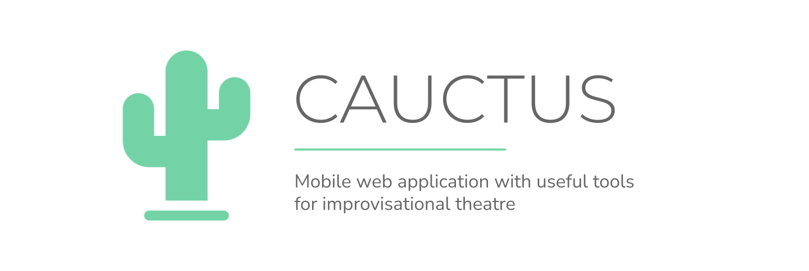

# Cautcus

Mobile web application with useful tools for improvisational theatre.

Available here: [cauctus.net](https://cauctus.net) (made for mobile screen).


## Development 
This application is made using [nuxt](https://nuxtjs.org), for detailed explanation on how things work, check out the [documentation](https://nuxtjs.org).

### Build Setup

```bash
# install dependencies
$ npm install

# serve with hot reload at localhost:3000
$ npm run dev

# lint
$ npm run lint

# generate static project
$ npm run generate
```

## Functionalities and roadmap
Please check the [issues](https://github.com/CorentinTh/cauctus/issues) to see if some feature listed to be implemented.

You have an idea of a tool? Submit a [feature request](https://github.com/CorentinTh/cauctus/issues/new?assignees=corentinth&labels=&template=feature_request.md&title=)!

## Credits
Coded with ❤️ by [Corentin Thomasset](//corentin-thomasset.fr).

This project is continuously deployed using [vercel.com](https://vercel.com).

## License
This project is under the [MIT license](LICENSE).

